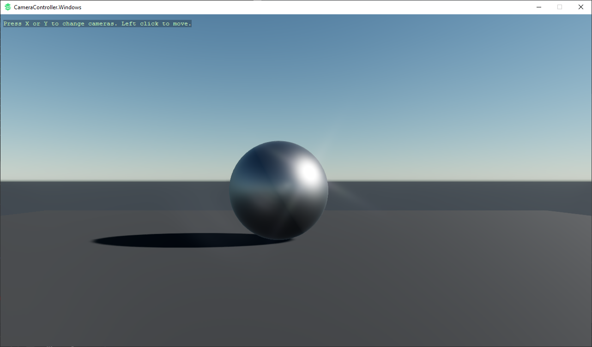

# Stride Camera Controller System
Camera Controller - Activating new cameras and subsequently raycasting through them (Resident Evil Style)

Press X or Y to change cameras, left click to "move."

---

The camera controller system includes:
1) A camera Db service for adding multiple cameras with a simple ActivateCamera API
2) A camera agent script for registering camera components
3) Player input script which demonstrates updating the camera component reference and raycasting through them
